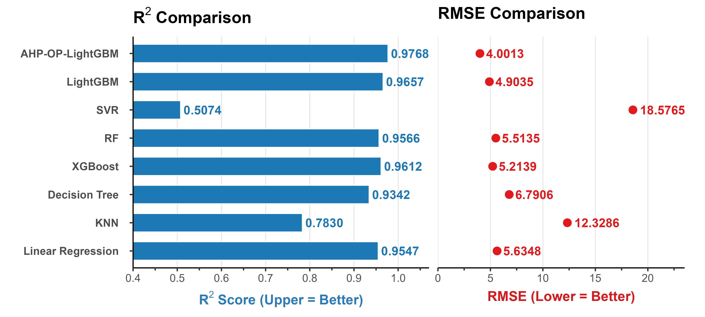

# An Explainable and Adaptive Framework for Intelligent Prediction of Tunnel Water Inflow based on Data Augmentation and AHP-OP-LightGBM

## 📌 Project Overview

Reliable prediction of tunnel water inflow is crucial for ensuring construction safety and risk control.  
This repository contains **data collection and processing, algorithm model, application and supporting materials** for the paper:  

> *An Interpretable Method and Incremental Learning Technique for Predicting Tunnel Water Inflow Based on Data Augmentation and AHP Improved OP-LightGBM*

Our approach integrates **data augmentation**, **model optimization**, **explainability**, and **online deployment**, offering a high-accuracy, interpretable, and generalizable solution to tunnel water inflow prediction.

---

## 🧠 Methodology Overview

- **Data Augmentation:**  
  Applied **SMOGN** (Synthetic Minority Over-sampling for Regression with Gaussian Noise) to balance sparse regression samples and suppress outliers.

- **Model Optimization:**  
  Constructed **AHP-OP-LightGBM** model by combining:
  
  - Optuna for hyperparameter optimization  
  - Analytic Hierarchy Process (AHP) to reweight features based on physical constraints  
  - LightGBM as the base regression model  
    Achieved **15.89% error reduction** compared to baseline.

- **Model Interpretability:**  
  Used **Correlation Analysis + SHAP** to reveal nonlinear synergy between geomechanical and hydrological parameters, providing physical interpretability.

- **Online Deployment:**  
  Built a **Web-based prediction system** with SHAP-based visualization and incremental learning capability, ensuring adaptability across projects.

---

## 🌐 Online Prediction System

You can try our **Tunnel Water Inflow Online Prediction System** here:  
🔗 **[https://wi.drcui.top](https://wi.drcui.top/)**

  

---

## 📂 Repository Contents

- `data/` – Sample datasets for training and validation
- `images/` – Figures for paper and README visualization
- `models/` – The improved model of AHP-OP-LightGBM and the regression models generated during the comparison experiment
- `Appendix Collection and processing of engineering application data.pdf` –  Engineering application data collection & preprocessing procedure  

---

## 📊 Example Results

  

- **Average Error Reduction:** 40.17%  
- **R² Improvement:** +18.86%  
- **Max Error (Incremental Learning Validation):** 1.9169 m³/h  

---
